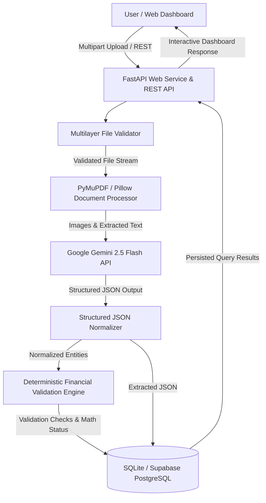

# Platform Architecture & System Design

## System Overview

The **Financial Document Intelligence Platform** processes uploaded financial documents (Invoices, Balance Sheets, Profit & Loss Statements, Cash Flow Statements) through a modular multi-layer architecture.

## Layer Architecture & Data Flow

1. **Upload Layer**: Form-data ingestion supporting PDF (max 3 pages), JPG, and PNG formats up to 10 MB.
2. **File Validation Layer**: Pre-flight verification (existence, size bounds, MIME signature magic bytes, PDF integrity & page count, image decodability).
3. **Document / Page Processing**: PyMuPDF (`fitz`) native text extraction or image rendering for scanned documents.
4. **AI Structured Extraction**: Multimodal Google Gemini 2.5 Flash prompt enforcing zero hallucination and raw visible extraction.
5. **Normalization**: Accounting format parser handling localized numbers, currency symbols, and parentheses `(5,000)` -> `-5000.0`.
6. **Deterministic Financial Engine**: Independent Python `Decimal` arithmetic evaluation per document type & period (`PASS`, `FAIL`, `NOT_APPLICABLE`).
7. **Database Persistence**: SQLAlchemy ORM with single `DATABASE_URL` config supporting SQLite locally and Supabase PostgreSQL in production.
8. **API & Dashboard Layer**: FastAPI backend serving Swagger OpenAPI UI (`/docs`) and Vanilla JS single-page web dashboard.
